# 🧠 OptimaLLM WebUI

[](https://opensource.org/licenses/MIT)
[](https://github.com/BjornMelin/optima-llm-webui/stargazers)
[](https://github.com/BjornMelin/optima-llm-webui/issues)

> **Intelligent hardware-aware LLM deployment system with automatic optimization for local AI models**

<div align="center">
  
</div>

## 📋 Table of Contents

- [Overview](#-overview)
- [Key Features](#-key-features)
- [Supported Models](#-supported-models)
- [Hardware Support](#-hardware-support)
- [Installation](#-installation)
- [Quick Start](#-quick-start)
- [Architecture](#-architecture)
- [Documentation](#-documentation)
- [Benchmarks](#-benchmarks)
- [Contributing](#-contributing)
- [License](#-license)

## 🔍 Overview

OptimaLLM WebUI is an intelligent system that automatically detects your hardware capabilities and optimizes the deployment of Large Language Models locally. Run advanced AI models with optimal settings for your specific hardware configuration, eliminating guesswork and manual tuning.

Whether you have a high-end GPU workstation or a modest laptop, OptimaLLM finds the perfect balance of performance and resource usage for your hardware.

```mermaid
flowchart LR
    Hardware["💻 Hardware Detection"] --> Profile["📊 Profile Selection"]
    Profile --> Models["🤖 Model Recommendations"]
    Models --> Config["⚙️ Optimal Configuration"]
    Config --> Deploy["🚀 Deployment"]
    Deploy --> WebUI["🌐 Web Interface"]

    classDef blue fill:#2374ab,stroke:#2374ab,color:white
    classDef green fill:#7eb356,stroke:#7eb356,color:white
    classDef purple fill:#684c96,stroke:#684c96,color:white
    classDef orange fill:#f68e5f,stroke:#f68e5f,color:white
    classDef red fill:#e1523d,stroke:#e1523d,color:white
    classDef yellow fill:#eace31,stroke:#eace31,color:black
    
    class Hardware blue
    class Profile green
    class Models purple
    class Config orange
    class Deploy red
    class WebUI yellow
```

<div align="center">



</div>

## ✨ Key Features

- **🔍 Dynamic Hardware Detection** - Auto-detects GPU, CPU, and RAM specifications to create optimal profiles
- **🧠 Intelligent Model Selection** - Recommends compatible models based on your hardware capabilities
- **⚡ Automatic Optimization** - Calculates optimal parameters for model inference (context length, batch size, etc.)
- **🔄 Flexible Configuration** - Choose between automatic optimization or manual configuration
- **🖼️ Multimodal Support** - Special handling for models that process both text and images
- **🐳 Docker-Based Deployment** - Easy deployment through containers with consistent environment
- **🌐 Web Interface** - Intuitive UI for interacting with your models via Open WebUI
- **⚠️ Graceful Degradation** - Works reasonably even on limited hardware with appropriate fallbacks

## 🤖 Supported Models

OptimaLLM WebUI supports a wide range of models, including:

### Gemma Family
- Gemma-3: 1B, 4B, 12B, 27B variants
- Gemma-2: 9B, 27B variants

### Phi Family
- Phi-4: Base and instruct variants
- Phi-4-Multimodal: Microsoft's multimodal version
- Phi-3: Medium and mini variants
- Phi-3.5: Mini instruct

### Mistral Family
- Mistral Small 3.1: 24B instruction model
- Mistral 7B: Various instruction-tuned versions
- Mixtral: 8x7B and 8x22B mixture-of-experts models

### Llama Family
- Llama 3.1: 8B, 70B, 405B parameter models
- Llama 3: Various sizes and instruction-tuned variants
- Llama 3.2 Vision: Multimodal models
- Llama 3.3: Latest iterations, including 70B model

### DeepSeek Family
- DeepSeek R1: Ultra-large 671B model
- DeepSeek R1 Distill Qwen: 32B distilled version
- DeepSeek R1 Distill Llama: 16B, 32B, 34B distilled versions
- DeepSeek R1 Distill Mistral: 8B, 12B distilled versions

...and many more! The model registry is continuously updated to support the latest models.

## 💻 Hardware Support

OptimaLLM WebUI optimizes for various hardware configurations:

- **High-End Workstations**: RTX 4090, RTX 3090 (24GB VRAM)
- **Gaming Laptops**: RTX 4090/4080 Mobile (16GB VRAM)
- **Mid-Range Systems**: RTX 3060-3080, RTX A2000 (8-12GB VRAM)
- **Entry-Level Systems**: Lower-end GPUs (4-6GB VRAM)
- **Professional GPUs**: NVIDIA A100, H100, L40 (40-80GB VRAM)
- **CPU-Only Mode**: Fallback for systems without GPUs

## 📦 Installation

### Prerequisites

- Docker and Docker Compose
- NVIDIA drivers and CUDA (for GPU acceleration)
- Python 3.10+ and UV (for dependency management)

### Installation Steps

```bash
# Clone the repository
git clone https://github.com/BjornMelin/optima-llm-webui.git
cd optima-llm-webui

# Setup environment
./scripts/setup-env.sh

# Check NVIDIA GPU support
./scripts/setup-nvidia.sh

# Get model recommendations for your hardware
python scripts/model_manager.py auto-recommend

# Add a recommended model
python scripts/model_manager.py add gemma-3-12b-instruct

# Start the system
./scripts/start.sh
```

## 🚀 Quick Start

After installation, the web interface will be available at http://localhost:3000

<div align="center">
  
</div>

### Basic Commands

```bash
# List available models in the registry
python scripts/model_manager.py list-available

# List your configured models
python scripts/model_manager.py list

# Check if a specific model is compatible with your hardware
python scripts/model_manager.py recommend llama-3.1-70b

# Switch to a different model
python scripts/model_manager.py activate gemma-3-27b-instruct
./scripts/start.sh

# Run a performance benchmark
python scripts/model_manager.py benchmark gemma-3-12b-instruct
```

## 🏗️ Architecture

OptimaLLM WebUI is built with a modular architecture:

<div align="center">


</div>

## 📚 Documentation

Comprehensive documentation is available in the [docs/](./docs/) directory:

- [Hardware Detection System](./docs/hardware-detection.md)
- [Model Registry](./docs/model-registry.md)
- [Configuration Options](./docs/configuration.md)
- [Docker Deployment](./docs/docker-deployment.md)
- [Multimodal Support](./docs/multimodal.md)
- [Troubleshooting Guide](./docs/troubleshooting.md)

## 📊 Benchmarks

Performance benchmarks across different hardware configurations:

| Model | Hardware | Quantization | Tokens/sec | Memory Usage | Context Length |
|-------|----------|--------------|------------|--------------|----------------|
| Gemma-3-27B | RTX 4090 | Q4_K_M | 58 t/s | 10.2 GB | 128K |
| Llama-3.1-8B | RTX 3060 | Q5_K_M | 42 t/s | 5.1 GB | 32K |
| Phi-4 | RTX 4080 Mobile | Q6_K | 76 t/s | 4.3 GB | 128K |
| DeepSeek-R1-32B | RTX 3090 | Q3_K_M | 28 t/s | 9.8 GB | 64K |
| Llama-3.3-70B | A100 80GB | Q6_K | 96 t/s | 38.2 GB | 128K |

## 👩‍💻 Contributing

Contributions are welcome! Please see [CONTRIBUTING.md](./CONTRIBUTING.md) for details on how to contribute to this project.

## 📄 License

This project is licensed under the MIT License - see the [LICENSE](./LICENSE) file for details.

---

<div align="center">
  <p>Made with ❤️ by the OptimaLLM Team</p>
</div>