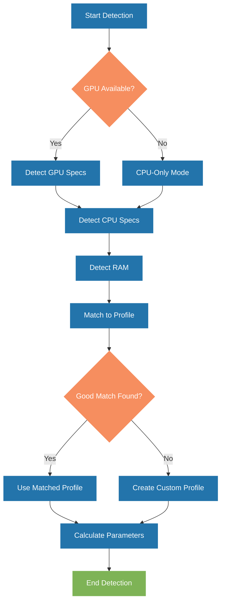

# 💻 Hardware Detection System

## Overview

The Hardware Detection System is a core component of OptimaLLM WebUI that automatically detects your hardware capabilities and determines optimal settings for running LLMs. This document explains how the system works and how you can customize it for your needs.

## Table of Contents

- [Detection Process](#detection-process)
- [Hardware Profiles](#hardware-profiles)
- [Parameter Calculation](#parameter-calculation)
- [Custom Profiles](#custom-profiles)
- [Manual Overrides](#manual-overrides)
- [Troubleshooting](#troubleshooting)

## Detection Process

The hardware detection process follows these steps:

1. **GPU Detection**
   - Primary method: `nvidia-smi` via subprocess calls
   - Fallback: Python libraries (e.g., `py3nvml`, `pycuda`)
   - Information gathered: GPU model, VRAM capacity, compute capability, driver version, CUDA version

2. **CPU Detection**
   - Uses `psutil` and platform-specific APIs
   - Information gathered: CPU model, cores, threads, cache sizes, AVX support

3. **Memory Detection**
   - Records total and available RAM
   - Determines swap space configuration

4. **Profile Matching**
   - Compares detected hardware against predefined profiles in `hardware_profiles.json`
   - Selects the closest matching profile based on weighted similarity scores

5. **Parameter Calculation**
   - Determines optimal context length based on available VRAM
   - Calculates appropriate batch sizes
   - Sets memory mapping strategies
   - Configures threading parameters

<div align="center">



</div>

## Hardware Profiles

Hardware profiles are stored in `config/hardware_profiles.json` and define optimal parameters for different hardware configurations. Each profile includes:

- **GPU Information**: VRAM capacity, compute capability, tensor core support
- **Recommended Models**: Models that work well with this hardware
- **Recommended Quantizations**: Optimal quantization levels for this hardware
- **Performance Parameters**: Settings for optimal performance (n_gpu_layers, batch_size, etc.)
- **Fallback Options**: Settings to use when recommended models are unavailable

Example profile:

```json
{
  "profile_id": "rtx4090_profile",
  "display_name": "NVIDIA RTX 4090",
  "gpu": {
    "vram_gb": 24,
    "compute_capability": "8.9",
    "tensor_cores": true,
    "recommended_models": ["gemma-3-27b", "llama-3.1-70b-q4_k_m", "deepseek-r1-32b"],
    "recommended_quantizations": ["q4_k_m", "q5_k_m", "q6_k"],
    "max_context_length": 128000,
    "parameters": {
      "n_gpu_layers": -1,
      "batch_size": 512,
      "threads": 8,
      "use_mlock": true,
      "contexts": 1
    }
  },
  "fallback": {
    "recommended_models": ["phi-3-mini-4k-instruct-q4_0", "gemma-2-2b-q4_0"],
    "parameters": {
      "n_gpu_layers": 32,
      "context_length": 8192
    }
  }
}
```

## Parameter Calculation

The system uses these formulas to calculate optimal parameters:

### VRAM Estimation

```
estimated_vram_gb = (model_size_gb * quantization_factor) + 
                   (context_length * batch_size * 2 * 4) / (1024*1024*1024) +
                   fixed_overhead_gb
```

### Optimal Context Length

```
max_context_length = min(
  model_max_context,
  (available_vram_gb - model_size_gb * quantization_factor - fixed_overhead_gb) * 
  (1024*1024*1024) / (batch_size * 2 * 4)
)
```

### CPU Thread Allocation

```
optimal_threads = min(
  available_cpu_threads - 2,
  4 if has_gpu else available_cpu_threads - 1
)
```

## Custom Profiles

If your hardware doesn't match any predefined profile, the system will create a custom profile based on detected specifications. You can also create custom profiles manually:

```bash
python scripts/hardware_detection.py create-profile --name "my_custom_profile"
```

This will guide you through creating a custom profile tailored to your hardware.

## Manual Overrides

You can override automatic hardware detection settings using command-line arguments or configuration files:

```bash
# Override context length
python scripts/model_manager.py update gemma-3-12b-instruct --context-length 32768

# Override GPU layers
python scripts/model_manager.py update gemma-3-12b-instruct --n-gpu-layers 32

# Override batch size
python scripts/model_manager.py update gemma-3-12b-instruct --batch-size 256
```

Or edit the configuration directly in `config/models.json`.

## Troubleshooting

### Common Issues

1. **NVIDIA GPU Not Detected**
   - Ensure NVIDIA drivers are installed and up-to-date
   - Check if `nvidia-smi` works in terminal
   - Try the fallback detection: `python scripts/hardware_detection.py --force-fallback`

2. **Incorrect VRAM Detection**
   - Manually specify VRAM: `python scripts/hardware_detection.py --vram-gb 12`
   - Check other processes using GPU memory

3. **Unexpected Profile Selection**
   - List available profiles: `python scripts/hardware_detection.py list-profiles`
   - Force a specific profile: `python scripts/hardware_detection.py --profile rtx3060_profile`

### Logs

Detailed logs are available in `logs/hardware_detection.log`. Include these when reporting issues.

### Advanced Troubleshooting

To run hardware detection in debug mode:

```bash
python scripts/hardware_detection.py --debug
```

This will print detailed information about the detection process.