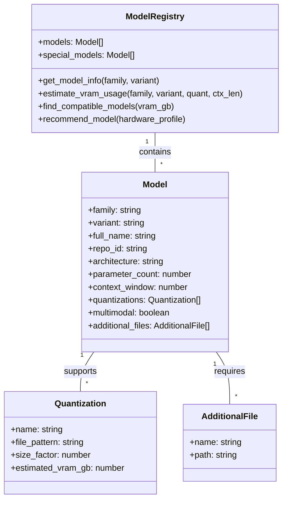

# 🤖 Model Registry System

## Overview

The Model Registry is a central component of OptimaLLM WebUI that maintains a database of available LLM models and their characteristics. It provides information about models, calculates VRAM requirements, and helps find models compatible with your hardware.

## Table of Contents

- [Registry Structure](#registry-structure)
- [Model Information](#model-information)
- [VRAM Calculations](#vram-calculations)
- [Quantization Support](#quantization-support)
- [Model Recommendations](#model-recommendations)
- [Adding New Models](#adding-new-models)
- [Multimodal Support](#multimodal-support)
- [API Reference](#api-reference)

## Registry Structure

The model registry is stored in `config/model_registry.json`. It contains comprehensive information about supported models, organized by model families and variants.

<div align="center">



</div>

## Model Information

Each model entry in the registry contains the following information:

- **Family**: Model family (e.g., "gemma", "llama", "phi")
- **Variant**: Specific variant (e.g., "gemma-3-27b-instruct")
- **Full Name**: Human-readable name (e.g., "Gemma 3 27B Instruct")
- **Repository ID**: Hugging Face repository ID
- **Architecture**: Underlying architecture
- **Parameter Count**: Size in billions of parameters
- **Context Window**: Maximum context length supported
- **Quantizations**: Available quantization formats
- **Multimodal Flag**: Whether the model supports both text and images
- **Additional Files**: Required auxiliary files for special models

Example model entry:

```json
{
  "family": "gemma",
  "variant": "gemma-3-27b-instruct",
  "full_name": "Gemma 3 27B Instruct",
  "repo_id": "unsloth/gemma-3-27b-GGUF",
  "architecture": "gemma",
  "parameter_count": 27,
  "context_window": 128000,
  "quantizations": [
    {
      "name": "q4_k_m",
      "file_pattern": "{variant}.Q4_K_M.gguf",
      "size_factor": 0.38,
      "estimated_vram_gb": 10.26
    },
    {
      "name": "q5_k_m",
      "file_pattern": "{variant}.Q5_K_M.gguf",
      "size_factor": 0.44,
      "estimated_vram_gb": 11.88
    }
  ],
  "multimodal": false,
  "additional_files": [],
  "recommended_parameters": {
    "temperature": 0.7,
    "top_p": 0.9,
    "repeat_penalty": 1.1
  }
}
```

## VRAM Calculations

The registry calculates VRAM requirements using the formula:

```
estimated_vram_gb = (model_size_gb * quantization_factor) + 
                   (context_length * batch_size * 2 * 4) / (1024*1024*1024) +
                   fixed_overhead_gb
```

Where:
- `model_size_gb` = parameter_count * 2 (for FP16 base size)
- `quantization_factor` = size_factor of the quantization (e.g., 0.38 for Q4_K_M)
- `context_length` = desired context window size
- `batch_size` = batch size for inference
- `fixed_overhead_gb` = additional memory needed for the model (typically 0.5-1GB)

## Quantization Support

The registry supports various GGUF quantization formats:

| Quantization | Bits | Size Factor | Quality |
|--------------|------|-------------|----------|
| Q2_K | 2-bit | ~0.25 | Lowest |
| Q3_K_S/M/L | 3-bit | ~0.32 | Low |
| Q4_0 | 4-bit | ~0.25 | Medium |
| Q4_K_S/M | 4-bit | ~0.38 | Medium |
| Q5_K_S/M | 5-bit | ~0.44 | High |
| Q6_K | 6-bit | ~0.50 | High |
| Q8_0 | 8-bit | ~0.50 | Highest |
| IQ2_XXS | 2.06-bit | ~0.26 | Low |
| IQ3_XXS | 3.06-bit | ~0.33 | Medium |
| IQ4_NL | 4-bit | ~0.40 | High |

For ultra-large models, special quantization formats like UD-IQ1_S (1.58-bit) are also supported.

## Model Recommendations

The system recommends models based on your hardware profile:

```python
def recommend_models(hardware_profile, prefer_quality=True):
    available_vram = hardware_profile['gpu']['vram_gb']
    compatible_models = []
    
    for model in model_registry['models']:
        for quant in model['quantizations']:
            if quant['estimated_vram_gb'] <= available_vram * 0.9:
                compatible_models.append({
                    'model': model,
                    'quantization': quant,
                    'quality_score': calculate_quality_score(model, quant),
                    'size_score': calculate_size_score(model, quant)
                })
    
    if prefer_quality:
        compatible_models.sort(key=lambda x: x['quality_score'], reverse=True)
    else:
        compatible_models.sort(key=lambda x: x['size_score'], reverse=True)
        
    return compatible_models[:5]  # Top 5 recommendations
```

The `quality_score` prioritizes larger models with higher quality quantization, while the `size_score` prioritizes more efficient models.

## Adding New Models

You can add new models to the registry either through the model manager or by editing the registry JSON file.

Using the model manager:

```bash
python scripts/model_manager.py register-model \
  --family gemma \
  --variant gemma-3-48b-instruct \
  --repo-id unsloth/gemma-3-48b-GGUF \
  --param-count 48 \
  --context-window 128000
```

This will add the model to the registry with default quantization information, which you can then customize if needed.

## Multimodal Support

Multimodal models (those that support both text and images) have special handling in the registry:

```json
{
  "family": "phi",
  "variant": "phi-4-multimodal-instruct",
  "full_name": "Phi-4 Multimodal Instruct",
  "repo_id": "microsoft/Phi-4-multimodal-instruct-GGUF",
  "architecture": "phi",
  "parameter_count": 4.8,
  "context_window": 128000,
  "multimodal": true,
  "additional_files": [
    {
      "name": "vision_tower.bin",
      "path": "vision/{variant}/vision_tower.bin"
    },
    {
      "name": "mmproj.bin",
      "path": "mmproj/{variant}/mmproj.bin"
    }
  ],
  "setup_commands": [
    "mkdir -p ./models/vision/{variant}",
    "mkdir -p ./models/mmproj/{variant}"
  ]
}
```

The `multimodal` flag, along with `additional_files` and `setup_commands`, helps the system properly configure these models.

## API Reference

The Model Registry module (`scripts/model_registry.py`) provides these key methods:

- `get_model_info(family, variant)`: Get information about a specific model
- `estimate_vram_usage(family, variant, quantization, context_length)`: Estimate VRAM requirements
- `find_models_for_vram(available_vram_gb, min_context_length)`: Find compatible models
- `recommend_model_for_hardware(vram_gb, prefer_quality)`: Get model recommendations
- `add_model(family, variant, repo_id, param_count, architecture)`: Add a new model
- `is_multimodal(family, variant)`: Check if a model is multimodal
- `get_additional_files(family, variant)`: Get required auxiliary files